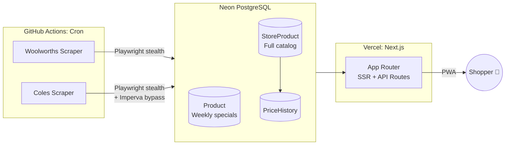

# AussieDeals

A mobile-first grocery deals aggregator that scrapes Woolworths & Coles weekly
specials, tracks price history, and helps Australian shoppers find the best
deals in-store.

**Live:** [aussie-deals.vercel.app](https://aussie-deals.vercel.app/)


<!-- TODO: Add screenshot or GIF of the app -->

## Why I Built This

Every week, Woolworths and Coles rotate their specials, but comparing deals
across both stores means flipping between two apps while standing in the aisle.
I built AussieDeals to solve my own problem first.

Now anyone looking to save on groceries can compare both stores' weekly specials
in one place. Price history tracking reveals whether a "sale" price is genuinely
the lowest it's been, so shoppers can make informed decisions instead of
falling for inflated discounts.

## Key Features

<!-- TODO: Add mobile screenshots -->
<!--
<p align="center">
  
  &nbsp;&nbsp;
  
</p>
-->

- **Weekly specials from both stores**: automated scrapers collect Woolworths
  & Coles deals every Wednesday via GitHub Actions
- **Price history charts**: track up to a year of price data per product to
  spot genuine deals vs. inflated discounts
- **Favourites watchlist**: save products across both stores and get an ON SALE
  badge when a watched item goes on special. Requires an account, so the list
  follows you between devices
- **Shopping cart**: build a list from this week's deals, grouped by store with
  estimated totals
- **Offline-capable PWA**: installable on mobile with service worker caching
  for in-store use on spotty Wi-Fi
- **Full product catalog**: ~82K products indexed across both stores, searchable
  with fuzzy text matching

## Architecture

Woolworths and Coles block direct HTTP requests from cloud servers.
All scraping runs on GitHub Actions using Playwright with stealth plugins,
then writes to a Neon PostgreSQL database that Vercel reads from.



## Technical Highlights

| Decision | Why |
|----------|-----|
| **Stealth scraping on CI** | Both stores block cloud IPs, so Playwright stealth + retry on GitHub Actions, no paid proxy needed |
| **Two-table data model** | Weekly specials (dated) vs. full catalog (permanent) separated for clean deal logic + price history |
| **Account-backed favourites** | Watchlist lives in the database so it syncs across devices; PWA caching covers spotty in-store Wi-Fi |
| **Price history without ETL** | Scraper upserts history records inline, so there is no separate pipeline, and it powers 52-week charts |
| **Size gate on matching** | Embeddings cannot see pack size, so `sameSize()` gates every cross-store match and abstains when a size is missing |

## Documentation

| File | What it holds |
|---|---|
| [DECISIONS.md](DECISIONS.md) | Why the architecture is shaped this way, including three decisions that were reversed after shipping |
| [INVARIANTS.md](INVARIANTS.md) | Domain rules that break things quietly when ignored, each one learned by shipping the opposite |

## Tech Stack

| Layer | Choice | Why |
|-------|--------|-----|
| Framework | Next.js 16 (App Router) | Server components for fast initial load; API routes co-located with UI |
| Database | PostgreSQL on Neon | Serverless Postgres with branching; generous free tier |
| ORM | Prisma 7 | Type-safe queries, schema-as-code with `db push` workflow |
| Auth | NextAuth.js v5 | Google OAuth with JWT sessions; adapts to Prisma out of the box |
| Scraping | Playwright + stealth plugins | Full browser needed to bypass anti-bot; runs headless on CI |
| Charts | Recharts | React-native charting; lightweight for simple price history graphs |
| Hosting | Vercel | Zero-config Next.js deploys; free tier covers this project's scale |
| CI/CD | GitHub Actions | Cron-triggered scrapers + Playwright pre-installed on runners |

## Development Journey

### Phase 1: concept & first scraper

Existing grocery deal apps in Australia felt slow, poorly designed, and
required a native install. A PWA made more sense, because it works from the browser on
any device, and if the project outgrows a web app, a native version can come
later. Started with Woolworths, whose undocumented browse API made it the
easier target, and built a basic specials viewer.

### Phase 2: Coles & the anti-bot fight

Coles has no public API. Product data is embedded in server-rendered
`__NEXT_DATA__`, protected behind Imperva's anti-bot challenges. Getting
reliable scraping working required Playwright stealth plugins, retry logic
with backoff, and careful page-navigation patterns to avoid detection.

### Phase 3: full catalog & data pipeline

A specials-only view wasn't enough for price comparison or history tracking.
I needed the full product catalog (~82K products across both stores), which
meant building GitHub Actions pipelines that could run for hours without
timing out, and upsert tens of thousands of rows per run.

### Phase 4: cart vs. favourites split

Early on, the cart doubled as a wishlist. But the two serve different
lifecycles: cart items are tied to this week's deals and expire when the sale
ends; favourites are permanent and will eventually trigger notifications when
a watched product goes on sale. Separating them unlocked the current
watchlist + ON SALE badge system.

### Current: cross-store matching, and validating it

The core platform is live with ~82K indexed products, automated weekly
scraping, and price history tracking. Cross-store matching now runs weekly on
persisted embeddings: 36,239 embeddings across brands that exist in both stores,
producing 2,861 product groups, gated on brand and pack size.

What is still open is the similarity threshold. It is the one constant in that
pipeline chosen by eye rather than measured, and it is the next piece of work.

## Roadmap

- [x] **Cross-store product matching**: shipped and running weekly, 2,861
      product groups from 36,239 embeddings
- [ ] **Validate the matching threshold**: hand-label ~100 known cross-store
      pairs, measure precision and recall across the range, and choose the
      threshold from the curve instead of by eye
- [ ] **Sale notifications**: PWA Web Push alerts when a favourited item goes
      on special
- [ ] **"Real deal" badge**: compare sale price against historical average to
      flag genuinely good deals
- [ ] **Cart comparison**: side-by-side Woolworths vs. Coles totals for the
      same shopping list
- [ ] **Personalised picks**: recommend deals based on favourite categories
      and purchase patterns

## Getting Started

<details>
<summary>Local development setup</summary>

### Prerequisites

- Node.js 22+
- PostgreSQL database (or a [Neon](https://neon.tech) free tier account)

### Setup

```bash
git clone https://github.com/Ga-hyeonKim/aussie-deals.git
cd aussie-deals
npm install
# create .env and fill in your credentials (see below)
npx prisma db push
npm run dev
```

### Environment variables

```
DATABASE_URL=           # PostgreSQL connection string
AUTH_SECRET=            # NextAuth secret (generate with: npx auth secret)
AUTH_GOOGLE_ID=         # Google OAuth client ID
AUTH_GOOGLE_SECRET=     # Google OAuth client secret
```

</details>
